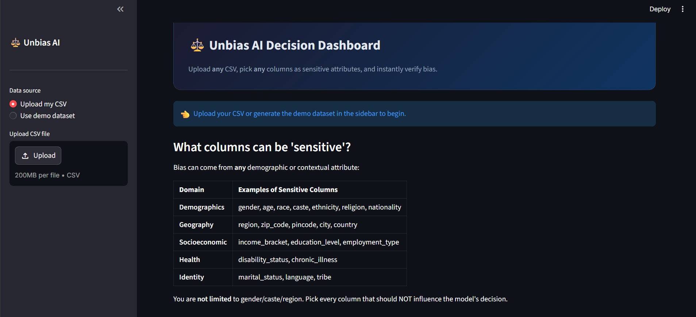
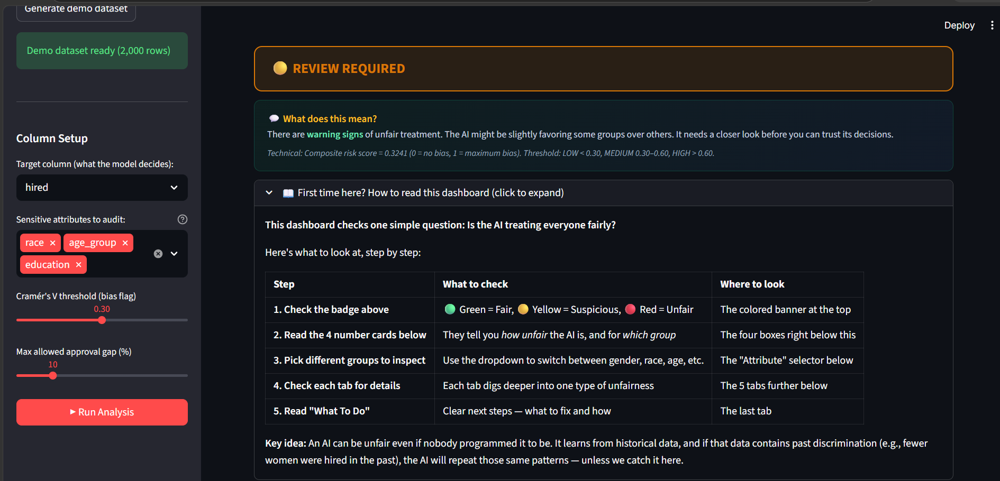
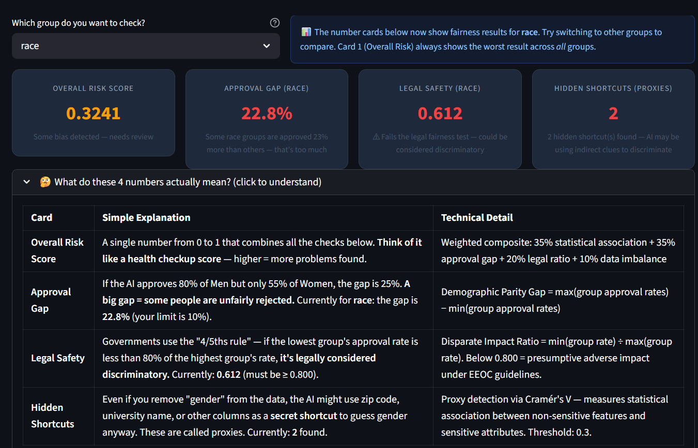
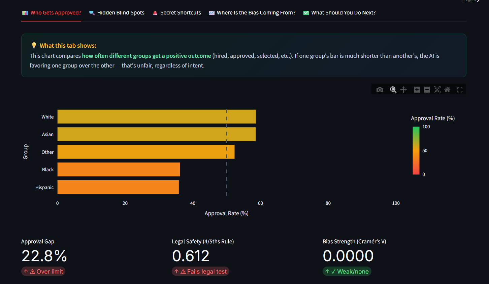
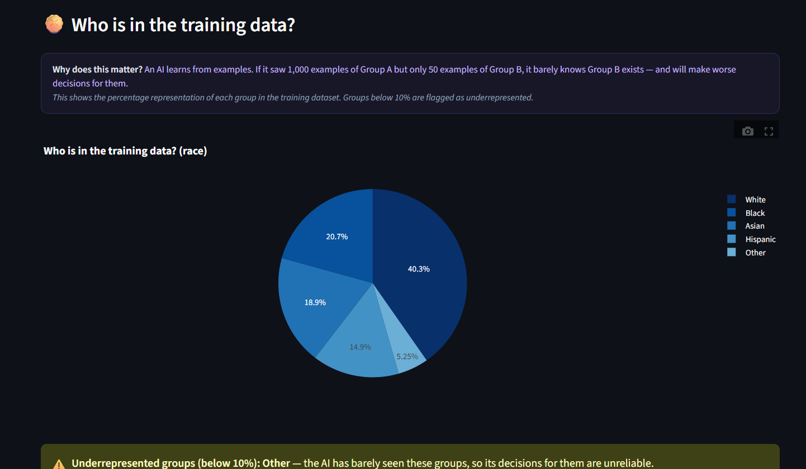
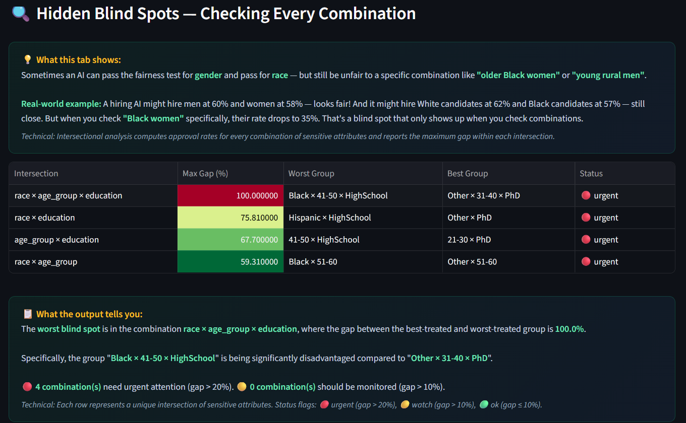
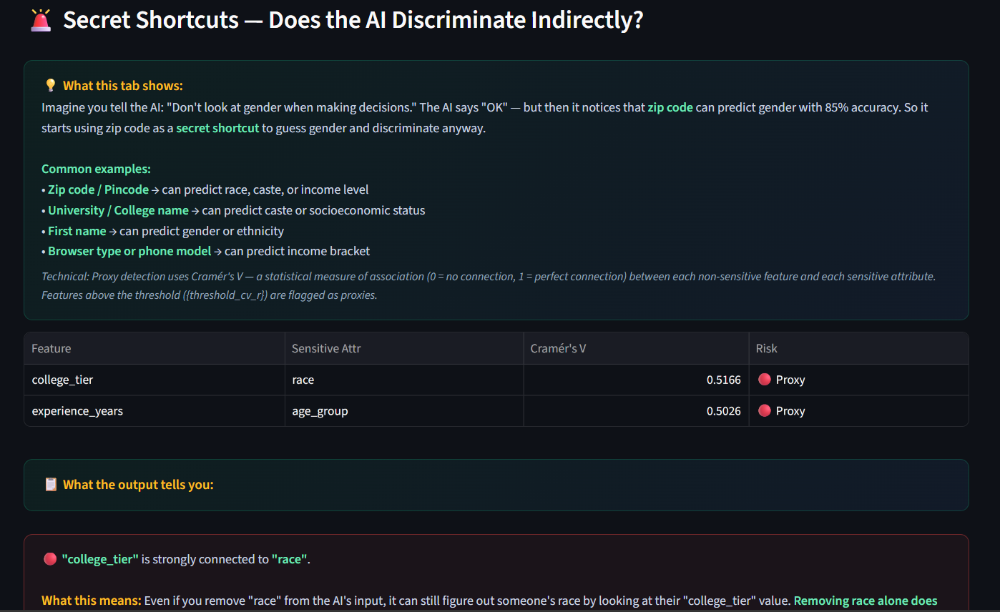
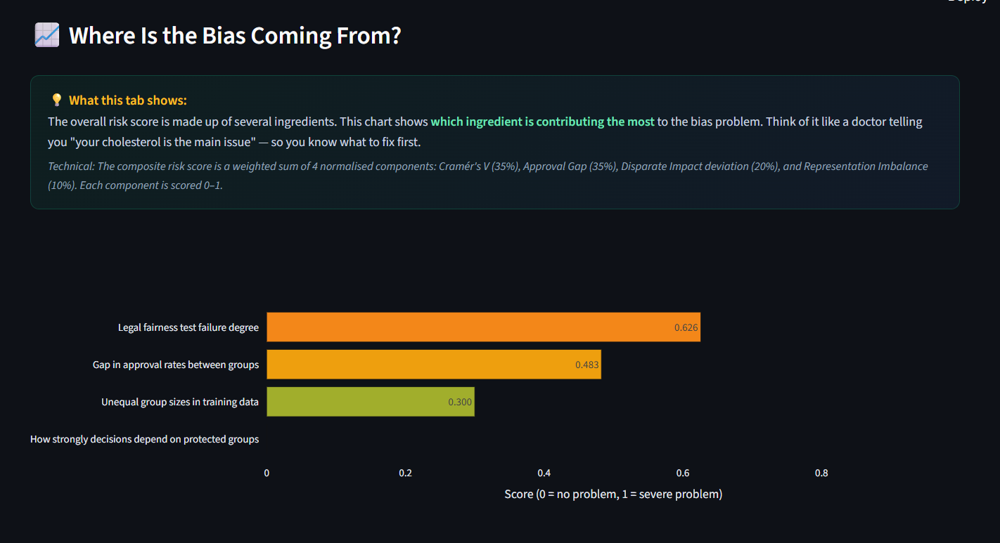
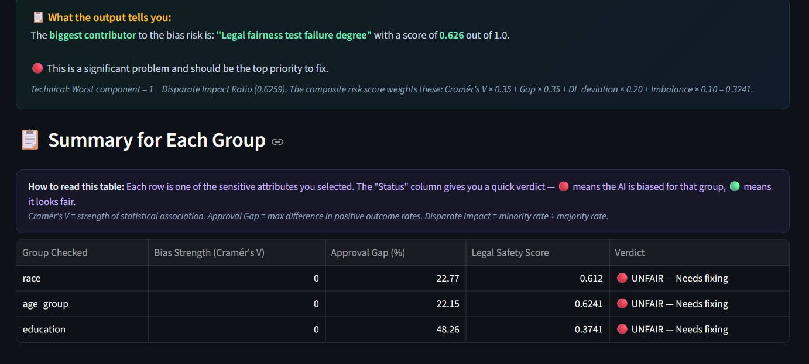
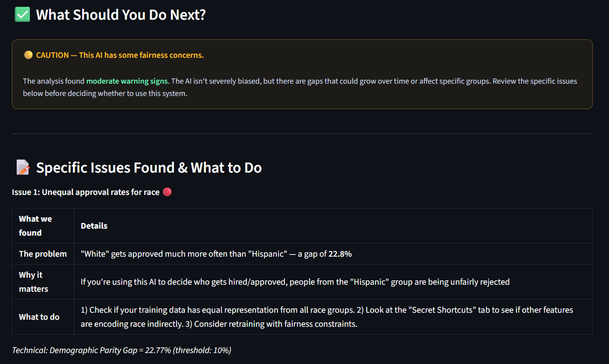

# ⚖️ Unbias AI Decision

> **Detecting, explaining, and fixing hidden discrimination in AI systems — before they impact real people.**

[](https://python.org)
[](https://streamlit.io)
[](https://fairlearn.org)
[](LICENSE)

---
Demo Video Link-https://drive.google.com/file/d/1gBfLwsws52BKGl8kYFbTmuDkkuBXxUaL/view?usp=sharing

Deplyed URL-https://biasness-in-ai-detection-j2j6v2fdmddhgat3mtwwsf.streamlit.app/

## 📌 Problem Statement

AI systems now make life-changing decisions — who gets a job, a bank loan, college admission, or medical treatment. These systems learn from historical data, and if that data contains decades of human bias (conscious or unconscious), the AI absorbs and repeats those same discriminatory patterns **at massive scale** — thousands of decisions per day, with no one checking.

**The core problems:**

1. **Hidden Bias** — An AI can discriminate without anyone programming it to. It learns patterns from biased historical records (e.g., "fewer women were hired in the past") and applies them to future decisions.

2. **Proxy Discrimination** — Removing a sensitive column like "gender" is not enough. Other features like zip code, university name, or first name can act as **secret shortcuts** to guess gender and smuggle discrimination back in.

3. **Intersectional Blind Spots** — An AI can pass fairness tests for gender *and* race individually, but still systematically fail a specific combination like "older Black women" or "rural SC women." These blind spots are invisible unless you explicitly check every combination.

4. **Label Corruption** — The "correct answers" the AI learns from (approved/rejected, hired/not-hired) may themselves be products of historical discrimination. If biased human managers made the original decisions, the AI learns to replicate their bias — and every fairness metric computed against those labels is meaningless.

5. **No Accountability** — Most organisations deploy AI without any audit trail, fairness monitoring, or explanation of why the AI made a specific decision. When regulators or affected individuals ask questions, there are no answers.

**Unbias AI Decision** is an automated 8-phase pipeline + interactive dashboard that solves all five problems. It detects bias, explains *why* it exists, fixes it with the least impact on accuracy, and monitors the system after deployment to catch new bias as it emerges.

---

## ✨ Features

### 🔬 8-Phase Bias Detection & Mitigation Pipeline

| Phase | What It Does |
|-------|-------------|
| **Phase 1 — Data Audit** | Checks who is in the data, finds missing data gaps, classifies why data is missing (MCAR/MAR/NMAR) |
| **Phase 2 — Data Cleaning** | Fair encoding, normalisation, inconsistency removal, proxy variable detection using Cramér's V |
| **Phase 3 — Label Audit** | Verifies if training labels themselves are biased using distribution analysis, counterfactual checks, and outcome comparison |
| **Phase 4 — Bias Detection** | Chi-square test, Fisher's exact test, Cramér's V, point-biserial correlation, PCA/MCA, intersectional analysis, bootstrap confidence intervals |
| **Phase 5 — Explainability** | SHAP-based root cause analysis — explains *which features* drive the bias and *how much* each contributes |
| **Phase 6 — Fairness Metrics** | Demographic parity, equalized odds, disparate impact ratio (legal 4/5ths rule), per-group calibration, individual fairness |
| **Phase 7 — Risk Scoring** | Composite 0–1 risk score with configurable weights, Pareto frontier analysis, sensitivity testing across 100 weight perturbations |
| **Phase 8 — Mitigation** | Automatic strategy selection: SMOTE oversampling (low risk), sample reweighting + feature intervention (medium), ThresholdOptimizer + ExponentiatedGradient (high risk) |

### 🖥️ Interactive Dashboard (Built for Everyone)

| Feature | Description |
|---------|-------------|
| **Plain-language explanations** | Every metric is explained in simple terms alongside the technical detail — no data science background needed |
| **"What does this mean?" panels** | Each chart, table, and number has a green explanation box: *"The AI approves Group A at 72% but Group B at only 45% — that's a 27-point gap"* |
| **"What should you do next?" callouts** | Every finding comes with clear, actionable next steps |
| **CSV upload — any dataset** | Upload any CSV, pick any columns as sensitive attributes, and run the analysis instantly |
| **Auto-detection** | Automatically suggests sensitive columns (race, age, gender, caste, zip code, religion, etc.) |
| **Dynamic KPI cards** | Overall Risk Score, Approval Gap, Legal Safety, Hidden Shortcuts — all update when you switch attributes |
| **Intersectional blind spot detection** | Checks every combination of sensitive attributes (e.g., age × race × education) |
| **Proxy variable detection** | Finds features that act as secret shortcuts for discrimination |
| **Risk breakdown chart** | Shows which component (statistical bias, approval gap, legal ratio, data imbalance) drives the overall risk |
| **"How to Read This Dashboard" guide** | Collapsible step-by-step guide for first-time users |
| **Detailed verdicts per group** | Each sensitive attribute gets a fairness report card with pass/fail results and simple explanations |

### 🛡️ Post-Deployment Monitoring

- Disparate impact trend tracking over time
- Data distribution drift detection (benign vs. harmful)
- Feedback loop detection
- Automated alerting (email/Slack webhook)
- Immutable audit log for regulatory compliance

---

## 🛠️ Tech Stack

### Core Libraries

| Purpose | Library | Role in Pipeline |
|---------|---------|-----------------|
| Data Manipulation | `pandas`, `numpy` | Used across all phases for data loading, transformation, and analysis |
| Statistical Testing | `scipy.stats` | Chi-square test, Fisher's exact test, Cramér's V, point-biserial correlation (Phases 2, 4) |
| Machine Learning | `scikit-learn` | StandardScaler, PCA, calibration curves, model training (Phases 2, 4, 6) |
| Fairness Metrics & Mitigation | `fairlearn` | Demographic parity, equalized odds, disparate impact, ThresholdOptimizer, ExponentiatedGradient (Phases 6, 8) |
| Oversampling | `imbalanced-learn` | SMOTE oversampling for underrepresented groups (Phase 8) |
| Explainability | `shap` | SHAP values per feature per group — root cause analysis of bias (Phase 5) |
| Causal Inference | `dowhy` | Counterfactual label checking — "would the outcome change if only the protected attribute changed?" (Phase 3) |
| Categorical Analysis | `prince` | Multiple Correspondence Analysis (MCA) for categorical data (Phase 4) |
| Missing Data Visualisation | `missingno` | Visualises patterns of missing data across groups (Phase 1) |

### Dashboard & Visualisation

| Purpose | Library |
|---------|---------|
| Interactive Dashboard | `streamlit` |
| Charts & Plots | `plotly` |
| Static Plots | `matplotlib`, `seaborn` |

### Configuration & Infrastructure

| Purpose | Library |
|---------|---------|
| Configuration Management | `pyyaml`, `pydantic-settings` |
| Production Monitoring | `evidently` |
| Audit Logging | `sqlalchemy` |

---

## 📥 Installation

### Prerequisites

- Python 3.10 or higher
- pip (Python package manager)
- Git

### Steps

```bash
# 1. Clone the repository
git clone https://github.com/Sak-patil/Biasness-in-ai-detection.git
cd Biasness-in-ai-detection

# 2. (Recommended) Create a virtual environment
python -m venv venv

# On Windows:
venv\Scripts\activate

# On macOS/Linux:
source venv/bin/activate

# 3. Install all dependencies
pip install -r requirements.txt

#4.Run the streamlit run dashboard.py command
```

---

## 🚀 Usage

### Option 1: Interactive Dashboard (Recommended)

```bash
# Generate the demo dataset (2,000 synthetic hiring records with embedded bias)
python generate_demo_data.py

# Launch the dashboard
streamlit run dashboard.py
```

Open **http://localhost:8501** in your browser, then:

1. **Upload your CSV** or click "Generate demo dataset" in the sidebar
2. **Select sensitive attributes** — the system auto-detects gender, race, age, caste, zip code, etc.
3. **Click "▶ Run Analysis"** — results appear instantly
4. **Read the badge** — 🟢 Green (fair), 🟡 Yellow (review needed), 🔴 Red (do not deploy)
5. **Explore the tabs** — each one explains findings in plain language with clear next steps

### Option 2: Full CLI Pipeline

```bash
# Run the complete 8-phase pipeline from the command line
python run_pipeline.py --config config.yaml --data demo_data.csv
```

This generates a detailed JSON report (`pipeline_report.json`) with all phase results.

### How to Read the Dashboard — Quick Guide

| Step | What to Check | Where to Look |
|------|--------------|---------------|
| 1 | Is the AI fair or unfair? | The colored badge at the top (🟢/🟡/🔴) |
| 2 | How bad is the unfairness? | The 4 KPI cards below the badge |
| 3 | Which groups are affected? | Use the attribute dropdown to switch between gender, race, age, etc. |
| 4 | What's causing the bias? | Check the 5 tabs: Who Gets Approved? → Hidden Blind Spots → Secret Shortcuts → Where Is the Bias Coming From? → What Should You Do Next? |
| 5 | What should I do? | The "What Should You Do Next?" tab gives numbered, specific actions |

---

## 📸 Screenshots






2nd tab - Hidden Blind Spots



3rd tab - Secret Shortcuts



4th tab - Where Is the Bias Coming From?




5th tab - Steps to take ahead




---

## 📁 Folder Structure

```
unbias-ai-decision/
│
├── dashboard.py                 ← Streamlit interactive dashboard (main entry point)
│                                  - Upload any CSV, pick sensitive attributes, run analysis
│                                  - Plain-language explanations alongside every metric
│                                  - 5 tabs: Approval Rates, Blind Spots, Proxies, Risk, Actions
│
├── run_pipeline.py              ← Full 8-phase CLI pipeline runner
│                                  - Runs all phases sequentially and outputs JSON report
│
├── generate_demo_data.py        ← Synthetic hiring dataset generator
│                                  - Creates 2,000 rows with intentionally embedded biases
│                                  - Biases in race, age_group; proxy in college_tier
│
├── demo_data.csv                ← Pre-generated demo dataset (2,000 rows)
│                                  - Ready to use — upload directly to the dashboard
│
├── config.yaml                  ← All thresholds & weights (fully configurable)
│                                  - Cramér's V threshold, legal 4/5ths rule, risk weights
│                                  - No hardcoded values — change behavior without touching code
│
├── requirements.txt             ← Python dependency list (pip install -r requirements.txt)
│
├── pipeline_report.json         ← Output from the CLI pipeline run
│
├── pipeline/                    ← Core analysis modules (one file per phase)
│   ├── __init__.py
│   ├── config.py                ← Configuration loader using dataclasses
│   ├── phase1_data_audit.py     ← Representation counts, missingness analysis, MCAR/MAR/NMAR
│   ├── phase2_data_cleaning.py  ← Fair encoding, normalisation, proxy detection (Cramér's V)
│   ├── phase3_label_audit.py    ← Label bias scoring, counterfactual checks
│   ├── phase4_bias_detection.py ← Chi-square, Fisher's, Cramér's V, intersectional, bootstrap CIs
│   ├── phase5_explainability.py ← SHAP per-group analysis, feature divergence, root cause report
│   ├── phase6_fairness_metrics.py ← Demographic parity, equalized odds, disparate impact, calibration
│   ├── phase7_risk_scoring.py   ← Composite score, Pareto frontier, sensitivity analysis
│   └── phase8_mitigation.py     ← SMOTE, reweighting, ExponentiatedGradient, ThresholdOptimizer
│
├── README.md                    ← This file
├── Unbias_AI_Decision_Complete.md ← Detailed system design document
└── .gitignore
```

---

## 🔮 Future Improvements

### Short-Term (Next Release)

- [ ] **Live monitoring dashboard** — Real-time disparate impact trend tracking with automated Slack/email alerts when the legal 4/5ths threshold is crossed
- [ ] **PDF report export** — One-click download of the full bias audit report in PDF format, ready to share with compliance teams or regulators
- [ ] **Confidence indicators on every metric** — Show high/medium/low confidence based on sample size and bootstrap CI width to prevent acting on unreliable statistics

### Medium-Term

- [ ] **Multi-language support** — Dashboard interface in Hindi, Spanish, and other languages for broader accessibility
- [ ] **API endpoint** — REST API wrapper around the pipeline for integration into CI/CD pipelines — run bias checks automatically on every model retrain
- [ ] **Database integration** — Connect directly to SQL/NoSQL databases instead of CSV uploads
- [ ] **Batch processing** — Upload multiple datasets and compare bias scores across models or time periods

### Long-Term (Research)

- [ ] **Causal fairness analysis** — Move beyond statistical correlation to true causal inference — understand *why* the bias exists at a causal level using DAGs (Directed Acyclic Graphs)
- [ ] **Federated bias detection** — Check for bias across distributed datasets without centralising sensitive data (privacy-preserving fairness)
- [ ] **LLM bias auditing** — Extend the pipeline to audit large language models for bias in text generation, not just tabular classifiers
- [ ] **Feedback loop simulation** — Simulate how the model's decisions today will affect the training data of tomorrow, predicting bias drift before it happens

---

## 📄 License

This project is licensed under the **MIT License** — free to use, modify, and distribute.

```
MIT License

Copyright (c) 2025 Unbias AI Decision

Permission is hereby granted, free of charge, to any person obtaining a copy
of this software and associated documentation files (the "Software"), to deal
in the Software without restriction, including without limitation the rights
to use, copy, modify, merge, publish, distribute, sublicense, and/or sell
copies of the Software, and to permit persons to whom the Software is
furnished to do so, subject to the following conditions:

The above copyright notice and this permission notice shall be included in all
copies or substantial portions of the Software.

THE SOFTWARE IS PROVIDED "AS IS", WITHOUT WARRANTY OF ANY KIND, EXPRESS OR
IMPLIED, INCLUDING BUT NOT LIMITED TO THE WARRANTIES OF MERCHANTABILITY,
FITNESS FOR A PARTICULAR PURPOSE AND NONINFRINGEMENT. IN NO EVENT SHALL THE
AUTHORS OR COPYRIGHT HOLDERS BE LIABLE FOR ANY CLAIM, DAMAGES OR OTHER
LIABILITY, WHETHER IN AN ACTION OF CONTRACT, TORT OR OTHERWISE, ARISING FROM,
OUT OF OR IN CONNECTION WITH THE SOFTWARE OR THE USE OR OTHER DEALINGS IN THE
SOFTWARE.
```

---

<p align="center">
  <b>⚖️ Unbias AI Decision</b><br>
  <i>Making AI fairness understandable for everyone — because the people affected by AI decisions deserve to know if they're being treated fairly.</i>
</p>
